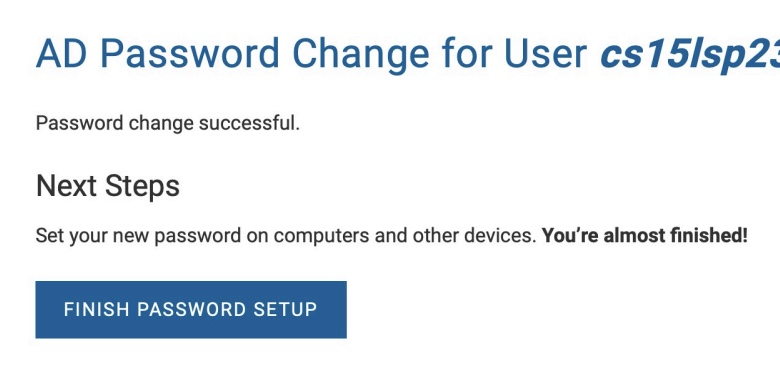
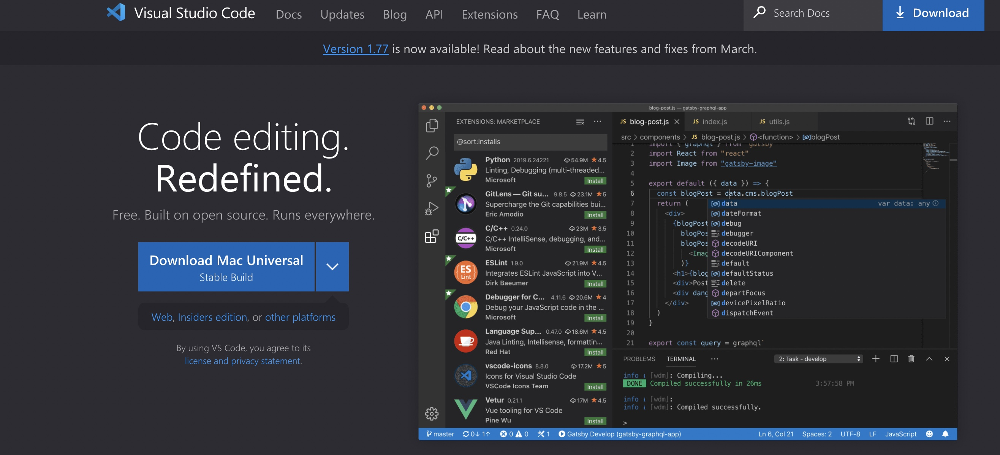
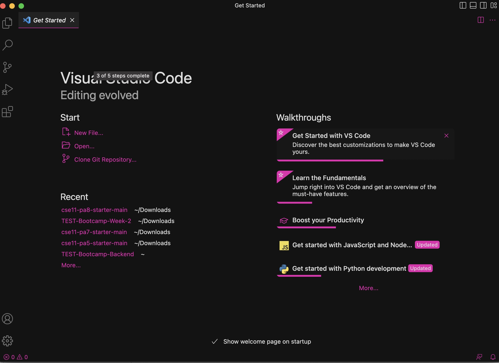

# CSE 15L Lab Report 1 - Remote Access and FileSystem on a Mac (Week 1)
**Melanie Haro**  
**A17390371**  

I will be showing you how to connect to remote access and understanding file systems on a Mac.  
**What is remote access and why is it used?**
- way to connect users to a remote computer 
- great tool for remote access
- allows you to log in and run commands on a remote machine just as if you were sitting in front of it 
## Logging into a remote SSH
## Step 1: CSE15L Account Lookup
1. insert TritonLink username and PID into Account Lookup module [Account Lookup](https://sdacs.ucsd.edu/~icc/index.php)
2. after hitting submit, click on the button for the class you want to reset the password for (in this case, it would be CSE 15L)
3. click on the [Global Password Change Tool](https://sdacs.ucsd.edu/~icc/password.php)
4. copy the username (cs12sp23**) where ** represent the letters specific to your account onto your clipboard (you will be using it for step 6)
5. click on [Proceed to the Password Change Tool](https://password.ucsd.edu/GetUser.aspx) underneath the **Student, AX, or Course-Specific Tab**
6. paste your username into the box below the **AD Password Change Tool**
7. click on [I want to reset my course-specific account password](https://password.ucsd.edu/GetUser.aspx#:~:text=I%20want%20to%20reset%20my%20course%2Dspecific%20account%20password)
9. authenticate with Duo
10. confirm email and navigate to your confirmation email
11. click on [UC San Diego Password reset page](https://password.ucsd.edu/secure/newadpass.aspx?token=5467deaf-1668-475b-a27a-d0d4b113f1a9%5c17572)
12. enter your new password that meets the requirements (different from previous passwords, at least 12 characters long, include upper & lower case, numbers and special symbols, not contain any part of your username) → *from previous experience: I have reset my password about 3 times total for CSE/ECE classes and found that when my password contained @!, my password reset process was more successful in the sense that it took less than 15 minutes for me to put in this newly reset password into the terminal after completing the SSH step)*
13. after clicking the **change password** button, you should see a page that has **"Password Change Successful"**

## Step 2: Downloading Visual Studio Code
1. go to the [Visual Studio Code website](https://code.visualstudio.com/)

2. click on **download Mac Universal**
3. open up the downloaded folder by going to your **Finder** app (command space and type in "Finder" if not available on your dock)
4. follow instructions on screen 
5. once it is installed, open a file (doesn't matter since you only need the terminal on VS Code) *I opened an old PA from CSE 11*

## Step 3: Connecting Remotely
*just to preface: when explaining the next steps which involve use of the terminal, when you see "$" here or anywhere else, it is representative of Ia convention for how we write commands*  
1. open up a terminal window in VS Code
2. type ssh and then the username cs12sp23**@ieng6.ucsd.edu
3. you should see the following  

## Step 4: Experimenting with Commands
**GUI vs CLI**  
You are most likely familiar with GUI which stands for **G**raphical **U**ser **I**nterface.
- GUI lets a user interact with the device/system with the help of graphical elements which can include windows, menus, icons, etc.
If you can't tell, when using the terminal, you can see that there are no windows, menus, or icons. So how are we supposed to navigate throughout the device/system? With CLI, which stands for **C**ommand **L**ine **I**nterface, you navigate throughout the device/system with commands!  
Here are some basic commands:  
- ls (abbreviation for list) → used to list the files and folders the given path
- cd (change directory) → used to switch the current working directory to the given path
- cd → takes user to the home directory
- cd ~ → takes user to the home directory
- cd .. → takes user to parent directory
- cat → Prints the contents of one or more files given by the paths
- mkdir → make a directory 
- rmdir → remove a directory (only works if it is empty)
- rm -r → remove directory that's not empty
Type these commands to see what happens. This is how you're going to navigate around the device/system.   
[Back](https://melanieharo22.github.io/cse15l-lab-reports/)
