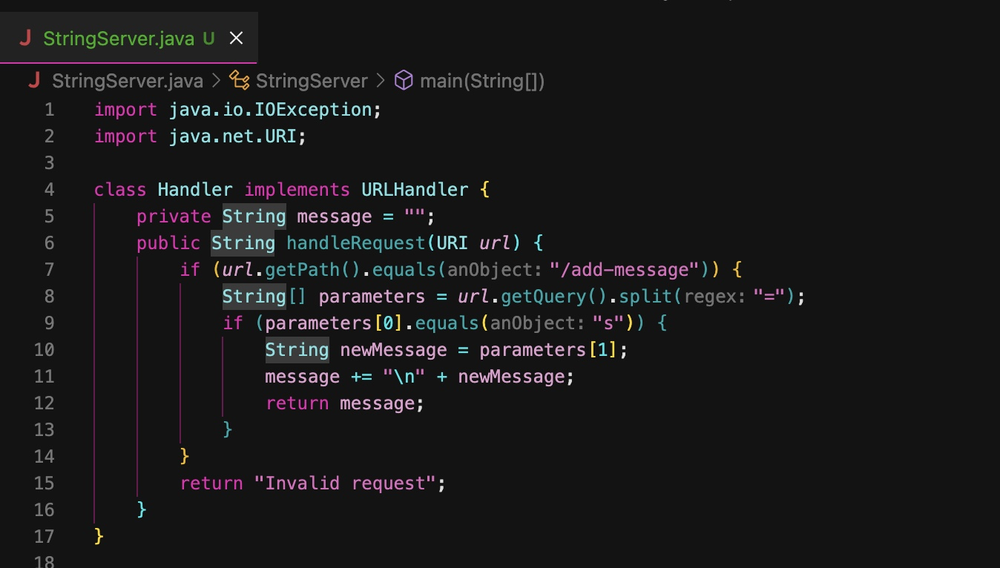
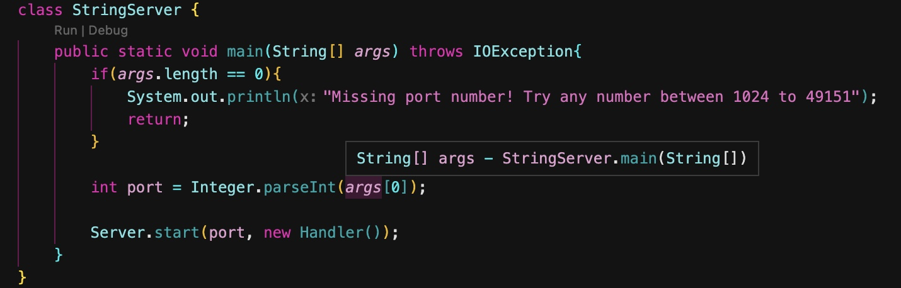
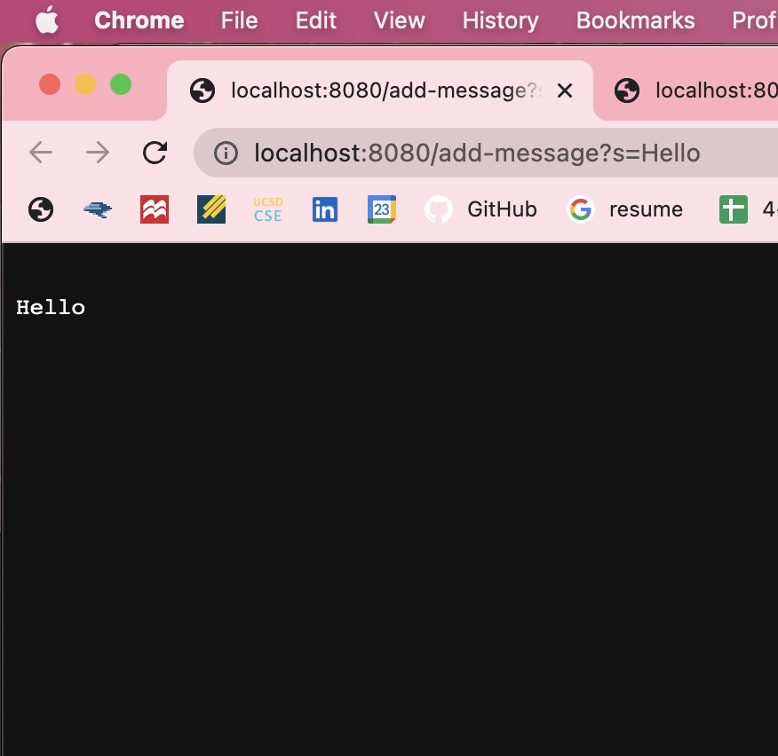
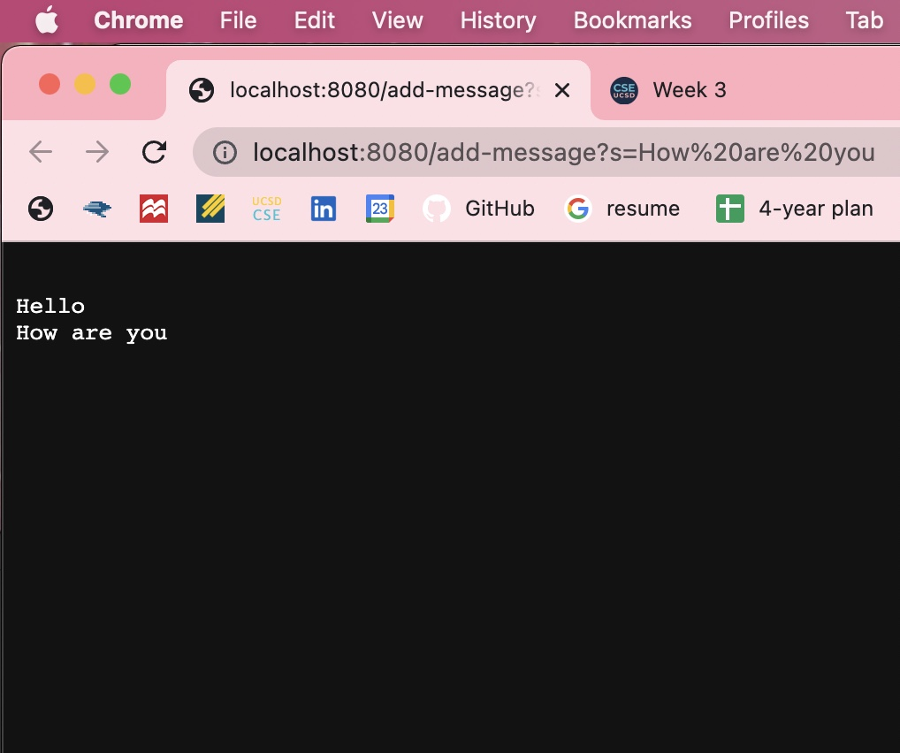
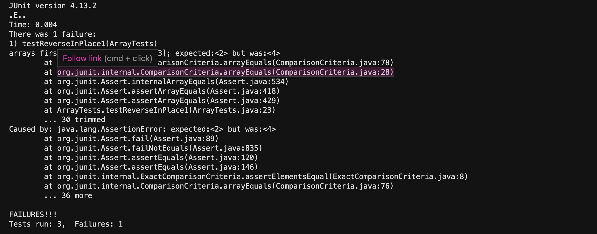

# CSE 15L Lab Report 2 - Servers and Bugs (Week 3)
**Melanie Haro** <br />
**A17390371** <br />

## Part 1





## Part 2
In lab this week, we created JUnit tests to identify bugs in the code provided. I tried to directly find out what was wrong with the methods but found that actually writing the tests in order to find out what was wrong with the program was more helpful. <br />
**Failure-inducing input for the buggy program (ReverseInPlace() method) proven by JUnit test**

```
@Test 
    public void testReversed2() {
    int[] arr = {1, 2, 3, 4, 5};
    int[] reversed = ArrayExamples.reversed(arr);
    assertArrayEquals(new int[] {5, 4, 3, 2, 1}, reversed);
    }
```
This test shows that there is an error in the program since it failed the test, meaning that we the actual value was not the same as the expect.
**Input that doesn’t induce a failure for the buggy program (also reverseInPlace() method) proven by JUnit test**
```
@Test 
    public void testReverseInPlace() {
    int[] input1 = { 3 };
    ArrayExamples.reverseInPlace(input1);
    assertArrayEquals(new int[]{ 3 }, input1);
    }
```

**Before the fix:**
```
static void reverseInPlace(int[] arr) {
    for(int i = 0; i < arr.length; i += 1) {
        arr[i] = arr[arr.length - i - 1];
    }
}
```
**After the fix:**
```
// Changes the input array to be in reversed order
  static void reverseInPlace(int[] arr) {
      int[] newArray = reversed(arr);
      for(int i = 0; i < arr.length; i += 1) {
          arr[i] = newArray[i];
      }
  }
```
The fixes address the issue since the original array is not being reversed in place correctly but after the fix, it reverse the way it is supposed to. Without changing the assignment of the array indices, the new array would not be filled with the reversed elements correctly.


**Symptoms** <br/>
*A symptom is a faulty program behavior you can see and in the image you can see that we can visibly see where our errors are occuring* <br />

In this image, I compiled and ran a total of 3 tests but only 2 of them tested **reverseInPlace()** as you can see, there was 1 failure which was from the buggy program since it did not do what we wanted it to do (logical error). The other test that doesn't induce a failure for the program passed.
**Failure-inducing input for the buggy program (reverseInPlace() method) proven by JUnit test**


## Part 3
Before labs 2 and 3 I didn't know about URIs, I was unsure what the URI keyword was doing before url as a parameter
 <br />
After lecture and reading the [documentation](https://docs.oracle.com/javase/8/docs/api/java/net/URI.html), I learned a few things:
- URI represents a Uniform Resource Identifier (URI) reference which is part of the Java libary 
- Is a character sequence that identifies a logical or physical resource connected to the internet
- A URI provides a simple, extensible way to identify internet resources
- URIs can identify different types of resources like webpages, images, electronic documents, etc.
