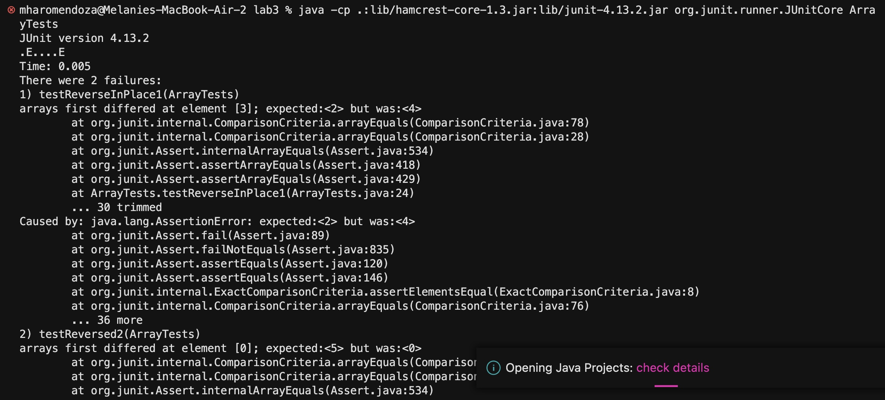
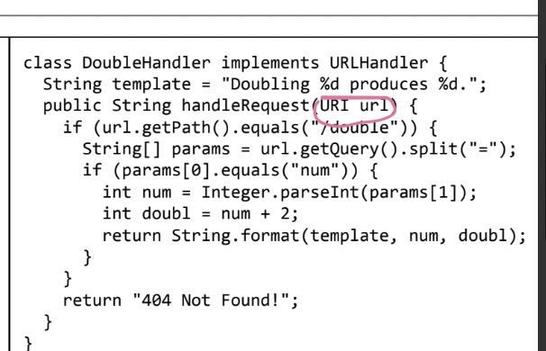

# CSE 15L Lab Report 2 - Servers and Bugs (Week 3)
**Melanie Haro** <br />
**A17390371** <br />

## Part 1

## Part 2
**Symptoms** <br/>


**Failure-inducing input for the buggy program (ReverseInPlace() method) proven by JUnit test**

```
@Test 
    public void testReversed2() {
    int[] arr = {1, 2, 3, 4, 5};
    int[] reversed = ArrayExamples.reversed(arr);
    assertArrayEquals(new int[] {5, 4, 3, 2, 1}, reversed);
    }
```
**Input that doesn’t induce a failure for the buggy program (also ReverseInPlace() method) proven by JUnit test**
```
@Test 
    public void testReverseInPlace() {
    int[] input1 = { 3 };
    ArrayExamples.reverseInPlace(input1);
    assertArrayEquals(new int[]{ 3 }, input1);
    }
```


## Part 3
Before labs 2 and 3 I didn't know about URIs, I was unsure what the URI keyword was doing before url as a parameter
 <br />
After lecture and reading the [documentation](https://docs.oracle.com/javase/8/docs/api/java/net/URI.html), I learned a few things:
- URI represents a Uniform Resource Identifier (URI) reference which is part of the Java libary 
- Is a character sequence that identifies a logical or physical resource connected to the internet
- A URI provides a simple, extensible way to identify internet resources
- URIs can identify different types of resources like webpages, images, electronic documents, etc.
