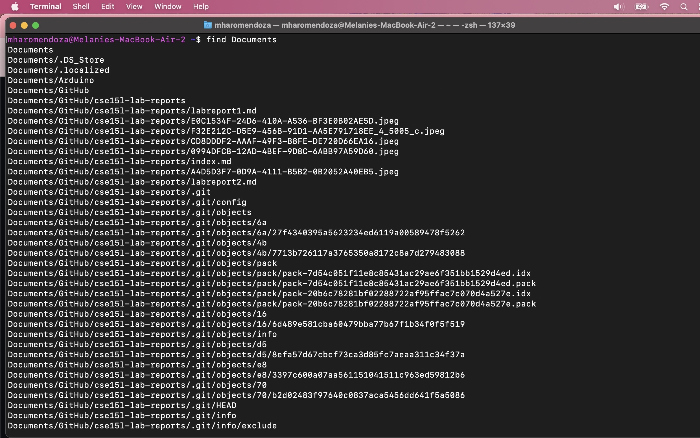

# CSE 15L Lab Report 3 - Researching Commands (Week 3)
**Melanie Haro** <br />
**A17390371** <br />

The **find** command is an incredibly useful command to find certain files and directories and not just by its file name. Here is an example of me running the find command in a zsh terminal window: <br />

Here I am in my working directory and used the find command to look for directories with the word "Documents" and as you can see I have a long list of different subdirectories and files with "Documents" in their path. <br />

There are many other alternative commands to find, my personal favorite being **fd**. It is a more evolved alternative to find and it is written in Rust. Its intention was to have a friendlier approach to the find command with better user interface and faster performance. However, it is a command you have to install. I installed it by opening [Homebrew](https://brew.sh/). Homebrew is a package manager and you can download lots of cool packages on there! Some of the cool ones I have gotten access to include **cmatrix** which just does the following: <br />
[Image]()

and **neofetch** <br />
[Image](Image 5-7-23 at 6.39 PM.jpeg) <br />
Which basically shows a ton of information about the device you are on. Many Linux users use this to flex their Linux distros. <br />
Back to the actual lab report though, I used brew to install the **fd** command. <br />
[Image]()
I already had brew downloaded on my Mac, but to download it you copy the link onto your clipboard, paste it into your terminal, and hit enter. If you want to check if you already had it installed, you can simply type **brew -v** to check what version you have installed. After installing brew, to install a command or package you would simply type **brew install** and then whatever it is you want to download. In this case, we want the **fd** command. <br /> 
```
brew install fd 
```
It should look something like this: <br /> 
[Image]() <br />

