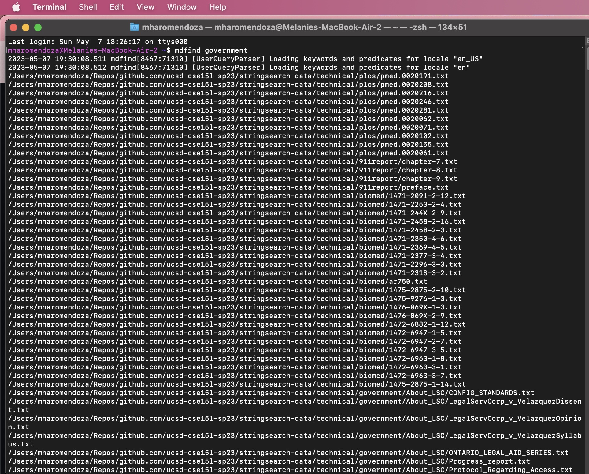

# CSE 15L Lab Report 3 - Researching Commands (Week 3)
**Melanie Haro** <br />
**A17390371** <br />

The **find** command is an incredibly useful command to find certain files and directories and not just by its file name. Here is an example of me running the find command in a zsh terminal window: <br />
 <br />
Here I am in my working directory and used the find command to look for directories with the word "Documents" and as you can see I have a long list of different subdirectories and files with "Documents" in their path. <br />

There are many other alternative commands to find, my personal favorite being **fd**. It is a more evolved alternative to find and it is written in Rust. Its intention was to have a friendlier approach to the find command with better user interface and faster performance. However, it is a command you have to install. I installed it using [Homebrew](https://brew.sh/). Homebrew is a package manager and you can download lots of cool packages on there! Some of the cool ones I have gotten access to include **cmatrix** which just does the following: <br />
 <br />

and **neofetch** <br />
 <br />
Which basically shows a ton of information about the device you are on. Many Linux users use this to flex their Linux distros. <br />
Back to the actual lab report though, I used brew to install the very useful **fd** command. I already had brew downloaded on my Mac, but to download it you copy the link on their homepage onto your clipboard, paste it into your terminal, and hit enter. If you want to check if you already had it installed, you can simply type **brew -v** to check what version you have installed. For instance, here I am checking for the version I have: <br />


After installing brew, to install a command or package you would simply type **brew install** and then whatever it is you want to download. In this case, we want the **fd** command. <br /> 
```
brew install fd 
```

Here is me using the **fd** command with files and directories from **./technical**: <br />
 <br />
As you can see I looked for files with "chapter" in their name. This could be useful if you are looking for a certain chapter within a directory instead of having to manually do it. <br />

Here I looked for anything with **txt** in their name: <br />
 <br />
This could be useful if your looking for txt files in case you want to cat them and see their contents. <br />

Another useful alternative to **find** is **mdfind**. This one works a replacement by default, so no need to install anything beforehand. Here I am typing **mdfind government** to find any file with government in its file path. This can be useful if you are looking for specific files with a key word in them. In this case lets say I was working on a government project and wanted to see every document in my home directory with the government keyword. <br />
 <br />

Here I used **mdfind ucsd-chapter** to look for a file/directory with the keyword "chapter". This would be useful if you are trying to find the repository you cloned from practicing for Skill Demo 1 or any file/directory containing a very specific keyword--in this case if you are looking for a specific chapter. <br />
 <br />

Another find alternative I used was **locate**. This one isn't a replacement by default on Mac OS and I had to install it independently of my package manager. I typed the following: <br />

```
sudo launchctl load -w /System/Library/LaunchDaemons/com.apple.locate.plist

```
where it then prompted me for my password and after that I ran: <br />
```
locate <file name>
```
<br />
Here is me using **locate biomed** to find biomed related texts in the database I was in after running the commands to isnstall locate: <br />
 <br />
This would be pretty useful if you were curious about what directories contained the keyword you are looking for in their name. In this case, I was curious which files contained "biomed". <br />

Here is another example of me using the **locate** command to find anything within the ./technical directory containing "plos". This shows that **locate** would be a useful command to find a file or directory with a specific keyword in mind. <br />


The last *interesting* alternative to **find** I came across was the **ripgrep (rg)** command. However it finds the contents of files as opposed to the file paths like the **find** command. However, it does show the file path of the specific file that contains text you want it to output. At first, I am not going to lie, it scared me and I thought I broke my computer. I asked ChatGPT ways I can use ripgrep and the first thing I tried was: <br />
```
rg example --type txt

```
This searched for the word "example" only in files with a specific extension (e.g., .txt) and it gave me a ton of output (way too much) so I only took a screenshot of a bit. This seems like a pretty inefficient version of find since it gave me WAY too much information. However, if you use **command F** you can look for anything, but it might take a while and defeats the purpose of even using the command. It might work if you have a super duper unique word. Here is what it looked liked when I typed the command I shared above: <br />
 <br />
Below I tried **rg** with a more unique word and I got the following output: <br />
 <br />
This command would be pretty useful if you wanted the name or location of a specific file you have in mind but don't remember anything except a unique word that was in the contents of that file. For instance, lets say I was trying to look for the txt file I was reading earlier by looking for unique words that could be IN the contents of a specific file I had in mind but couldn't remember. And let's say that I remember the word "bequeath" being in that file. After typing **rg bequeath --type txt** I found the file I was reading earlier but was only able to remember a word in that txt file.

Citations: <br />
overall: [Homebrew Documentation](https://docs.brew.sh/) <br />
fd -> [sharkdp/fd](https://github.com/sharkdp/fd) <br />
mdfind -> [mdfind: A Command-line Interface to macOS's Spotlight](https://metaredux.com/posts/2019/12/22/mdfind.html) <br />
locate -> [Enable and Use the ‘locate’ Command in the Mac OS X Terminal](https://osxdaily.com/2011/11/02/enable-and-use-the-locate-command-in-the-mac-os-x-terminal/) && [locate command in Mac | find files and directories using locate in Mac terminal](https://youtu.be/lhwp5QfqmhE)<br />
ripgrep -> [BurntSushi/ripgrep](https://github.com/BurntSushi/ripgrep) && ChatGPT by asking about ripgrep examples :)
