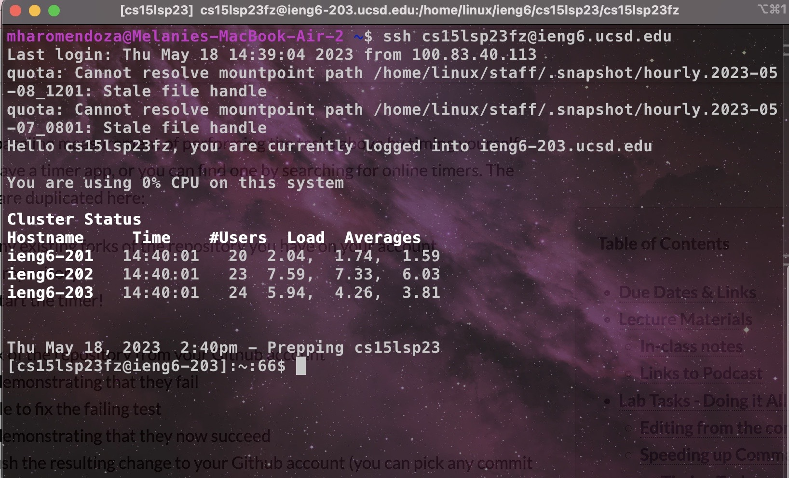
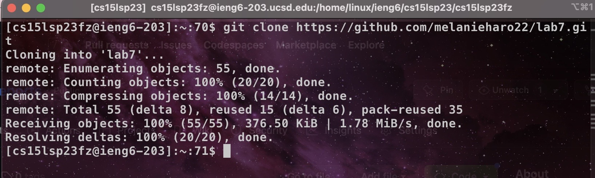

# CSE 15L Lab Report 4 - Doing it All From the Command Line (Week 7)
**Melanie Haro** <br />

The first step is to ssh into your ieng6 account. <br /> 
During lab, we had to create ssh keys which ends up saving you so much time because you don't have to type a password every single time you want to log into the remove ieng6 server. If you want to consider saving yourself some time, you will want to create an ssh key. <br />
 <br />
The next step is to clone the fork of the repository by using the git clone command. <br />
```
git clone https://github.com/melanieharo22/lab7.git
```
<br />
 <br />
