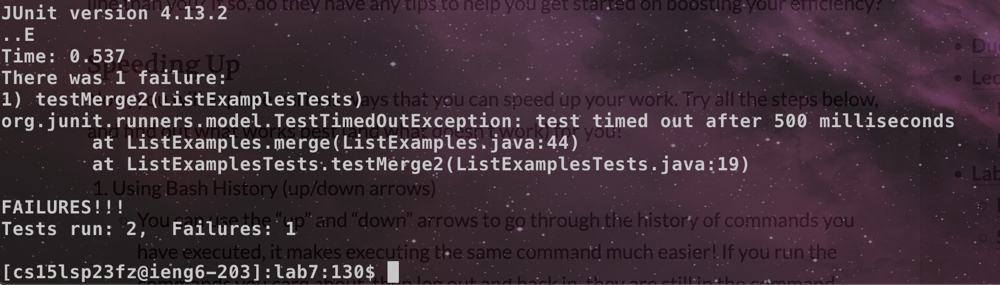
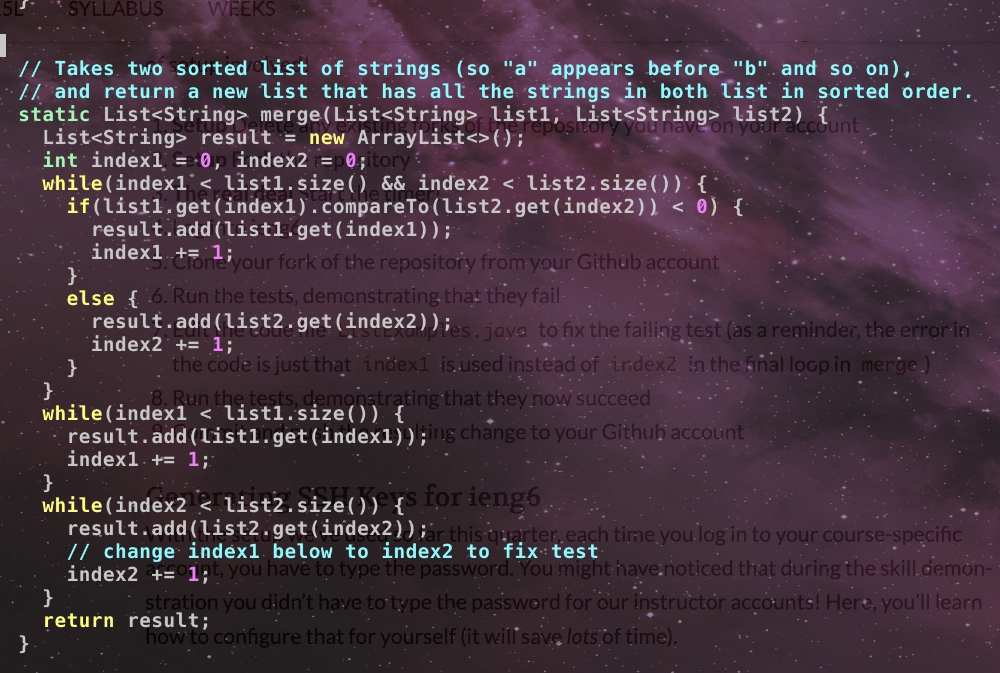
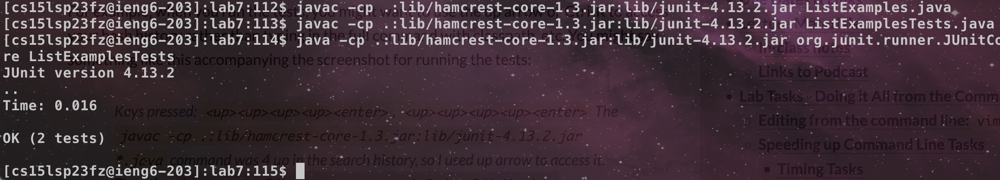
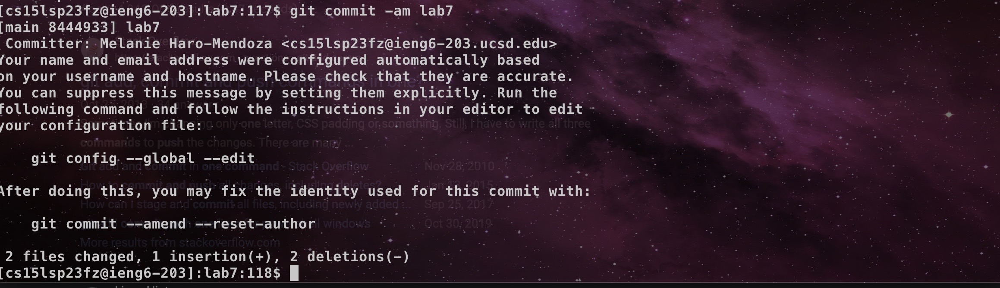

# CSE 15L Lab Report 4 - Doing it All From the Command Line (Week 7)
**Melanie Haro** <br />

The first step is to ssh into your ieng6 account. <br /> 
During lab, we had to create ssh keys which ends up saving you so much time because you don't have to type a password every single time you want to log into the remove ieng6 server. If you want to consider saving yourself some time, you will want to create an ssh key. <br />
 <br />
The next step is to clone the fork of the repository by using the git clone command. <br />
```
git clone https://github.com/melanieharo22/lab7.git
```
 <br />
Next to test the JUnit tests, you're going to want to **cd** into the lab7 directory and compile both ListExamples and ListExamplesTests. After that you are going to run ListExamplesTests to now run the JUnit tests. <br />
```
javac -cp .:lib/hamcrest-core-1.3.jar:lib/junit-4.13.2.jar ListExamples.java
javac -cp .:lib/hamcrest-core-1.3.jar:lib/junit-4.13.2.jar ListExamplesTests.java
java -cp .:lib/hamcrest-core-1.3.jar:lib/junit-4.13.2.jar org.junit.runner.JUnitCore ListExamplesTests

```

 <br />
This is what the tests look like after compiling both files and running **ListExamplesTests**. We can see the tests failing. <br />
To fix the tests, we needed to fix the bug in the **ListExamples.java** file first. The bug in the code is that index1 is used instead of index2 in the final loop in merge. To fix this we need to go into **ListExamples.java** using Vim. <br />
To do this, type <br />
```
vim ListExamples.java
```

I then used <j> to scroll down to the line that needed to be changed where index1+= 1 had to become index2+= 1 to fix the code. I then pressed <l> a few times until I reached the 1 in index1+= 1 and hit the <x> button to get rid of that character. I then went into insert mode by clicking "i" and after that I replaced the 1 with a 2. After that I clicked <esc> and type <:wq> to save the file. This is what the code looked like after fixing the bug. <br /> 
 <br />

To run the tests now, you have to compile ListExamples and ListExamplesTests again. This is how I did it: <br />
<up><up><up><up><up><enter> The 
  ``` 
  javac -cp .:lib/hamcrest-core-1.3.jar:lib/junit-4.13.2.jar ListExamples.java 
  ```
command was used previously so instead of typing out the entire command, I used the up arrow to save me some time. I then typed <up><up><up><up><enter> so that I can compile 
  ```
  javac -cp .:lib/hamcrest-core-1.3.jar:lib/junit-4.13.2.jar ListExamplesTests.java
  ```
  After that, I typed <up><up><up><enter> to run the ListExamplesTests.java file
 ```
 java -cp .:lib/hamcrest-core-1.3.jar:lib/junit-4.13.2.jar org.junit.runner.JUnitCore ListExamplesTests
 ```
This is what it looked liked when the tests succeeded after the code was fixed <br />
 
  
After that, this is how I committed and pushed the resulting change to my Github account. I did this by typing git commit -am lab7 <br />
  

You can see that I committed and pushed the change to my Github account.
