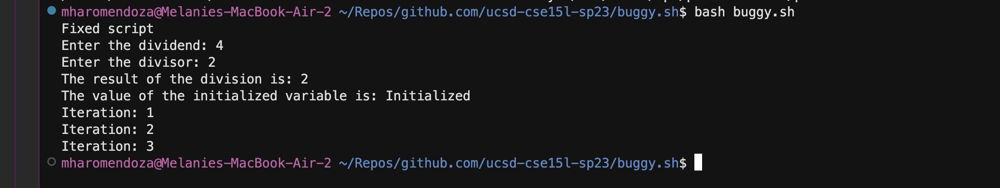
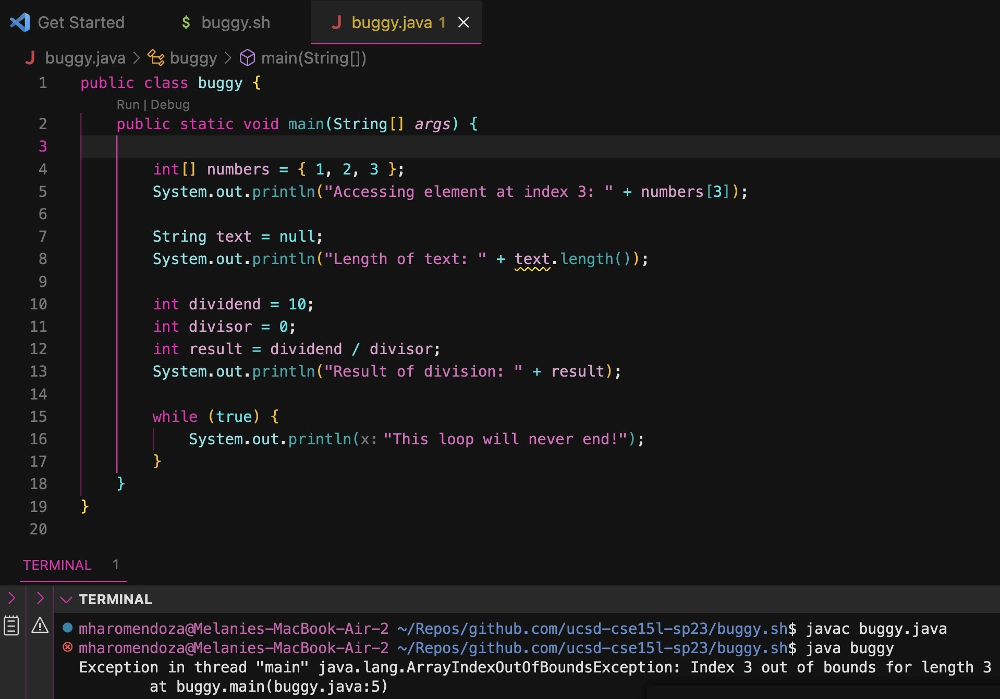

# CSE 15L Lab Report 5 - Debugging & Reflection
**Melanie Haro** <br />
**Part 1: Debugging Scenario** <br />
A student was struggling with a bash script that asked for user input for a dividend and divisor and performed some division. This is what the 
student posted in their Edstem post asking for help. <br />

These are images the student attached in their post: <br />
This is the bash script itself: <br />

This is the output shown in the student's terminal: <br />

This is what the TA/Tutor posted in response: <br />
"I don't see any errors regarding your file structure or because of the commands you used to run your bash script. But, it looks like your while loop is causing you some trouble, it is giving you a logical error. When you set your while loop to always run as long as it is true, it will run an infinite amount of times. Try fixng your while loop to only make it run a certain amount of times--basically execute a certain number of iterations. I suggest using counter variable to keep track of the number of iterations and exits the loop after a specific number of iterations." <br />
<br />
After seeing this feedback, the student went back and fixed their code to include a counter variable in their while loop. <br />

This is the new, correct output after fixing the logical error: <br />

The student added a counter variable which helped the while loop from running an infinite number of times. <br />

This student wanted to try making the same type of program but in Java. This poor student can't seem to escape the bugs in their code and now has to figure out what is wrong. This is the following Java program with roughly the same thing they did in the first place. <br />
 
This is the Edstem post the student posted once again. <br />

The same TA/Tutor helped answer their question in terms of what was wrong with their code: <br />
"Looks like there is another logical error in your code which is causing the ``` Exception in thread "main" java.lang.ArrayIndexOutOfBoundsException: Index 3 out of bounds for length 3
        at buggy.main(buggy.java:5) ``` error. In order to fix this you need to address the different exceptions that could be causing your program to break. This can include NullPointerExceptions, IndexOutOfBoundsExceptions, arithmetic exceptions occuring, and again fixing the while loop to not go on forever. Try applying what you did to fix your bash program to this Java program as well--at least for the while loop part. <br />
        
 The student then took into account what the IA told them and fixed their code and now it looks like the following. <br />
 

**Part 2: Reflection** <br /> 
I really enjoyed this class because I learned a plethora of skills and techniques that will save me time. I additionally learned a 
lot of useful tools such as Vim, bash, Git, and being exposed to that in this class has helped me explore them even further outside of 
class and even use them during other times. I've found myself writing bash scripts and using Vim and bash in the IEEE-Supercomputing club to run cool benchmarks like the HPL and HPCG benchmarks. The most important thing I have learned was to use "tab" because it saves you time. I learned how to be more efficient, but also creative. <br />
